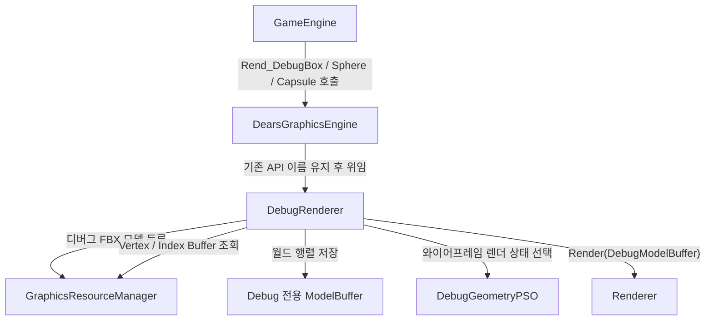
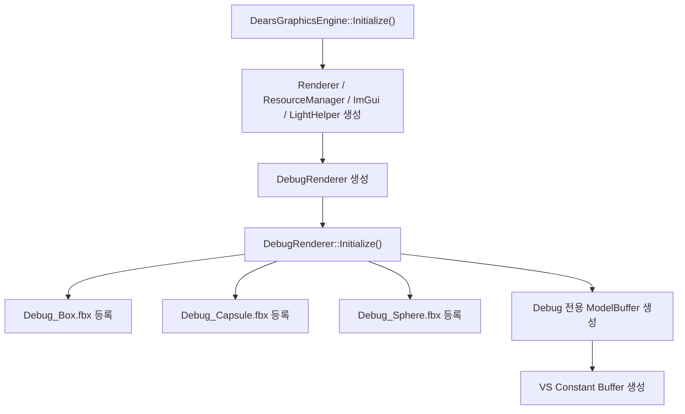
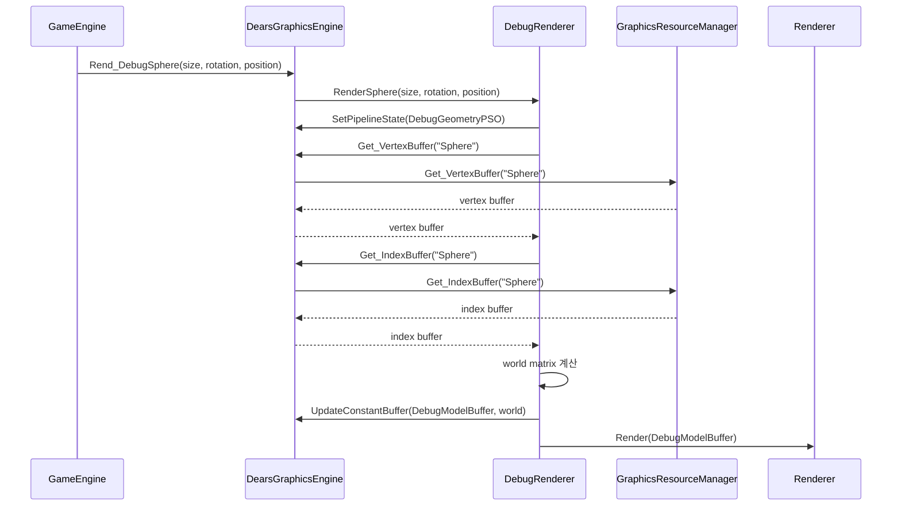
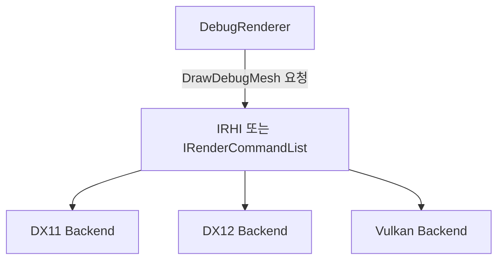

# 2026-07-08 DebugRenderer 구조 정리

## 작업 목적

이번 작업의 목적은 `DearsGraphicsEngine` 안에 직접 들어 있던 디버그 렌더링 책임을
`DebugRenderer` 클래스로 분리하는 것이다.

외부에서 호출하는 함수 이름은 그대로 유지했다.

- `DearsGraphicsEngine::Rend_DebugBox(...)`
- `DearsGraphicsEngine::Rend_DebugSphere(...)`
- `DearsGraphicsEngine::Rend_DebugCapsule(...)`

즉 `GameEngine` 입장에서는 기존처럼 `DearsGraphicsEngine`에 디버그 도형 렌더링을 요청한다.
하지만 실제 디버그 도형 준비와 렌더링 처리는 `DebugRenderer`가 맡는다.

---

## 현재 책임 분리



같은 내용을 이미지로 보고 싶을 때는 아래 파일을 열면 된다.

- `Docs/2026-07-08-debug-renderer-structure.svg`

---

## 초기화 흐름



초기화에서 중요한 점은 디버그 모델 리소스 등록 위치가 `DebugRenderer::Initialize()`로 이동했다는 것이다.
그래서 디버그 렌더링에 필요한 자원이 어디서 준비되는지 추적하기 쉬워졌다.

---

## 렌더 호출 흐름

예를 들어 `GameEngine`에서 디버그 구를 그리는 흐름은 다음과 같다.



---

## 쉽게 말하면

기존 구조는 다음과 비슷했다.

```text
DearsGraphicsEngine
  - 렌더러 생성
  - 리소스 관리
  - ImGui 관리
  - 조명 관리
  - 파티클 관리
  - 디버그 도형 렌더링까지 직접 처리
```

지금 구조는 다음처럼 한 단계 나누었다.

```text
DearsGraphicsEngine
  - 그래픽스 엔진의 큰 흐름을 관리
  - 기존 Rend_Debug... API를 유지
  - 실제 디버그 렌더링은 DebugRenderer에게 위임

DebugRenderer
  - 디버그 모델 로딩
  - 디버그 전용 ModelBuffer 소유
  - Box / Sphere / Capsule 렌더링
  - DebugGeometryPSO 선택
  - world matrix 계산
```

---

## RHI 관점에서 의미

아직은 `DebugRenderer`가 `DearsGraphicsEngine`의 DX11 기반 함수들을 사용한다.
그래서 완전한 RHI 분리는 아니다.

하지만 `DearsGraphicsEngine` 본체에서 디버그 렌더링 구현을 빼낸 덕분에,
다음 단계에서는 이 구조로 발전시킬 수 있다.



즉 이번 작업은 "DX11 코드 제거"가 아니라,
나중에 DX11 / DX12 / Vulkan 백엔드를 갈아끼울 수 있도록 책임을 작게 나누는 첫 단계다.

---

## 이번 변경 파일

- `DearsGraphicsEngine/DebugRenderer.h`
- `DearsGraphicsEngine/DebugRenderer.cpp`
- `DearsGraphicsEngine/DearsGraphicsEngine.h`
- `DearsGraphicsEngine/DearsGraphicsEngine.cpp`
- `DearsGraphicsEngine/DearsGraphicsEngine.vcxproj`
- `DearsGraphicsEngine/DearsGraphicsEngine.vcxproj.filters`

---

## 다음에 보면 좋은 방향

다음 분리 후보는 다음 둘 중 하나가 좋다.

1. `DearsGraphicsEngine`의 일반 모델 렌더 함수들을 `MeshRenderer` 같은 클래스로 분리
2. `DearsGraphicsEngine`의 리소스 생성/조회 API를 RHI 친화적인 인터페이스로 정리

개인적으로는 1번이 더 안전하다.
`Rend_Model`, `Rend_AnimateModel`, `Rend_PBR`, `Rend_Water`처럼 현재 렌더 함수들이 이미 종류별로 나뉘어 있기 때문이다.
